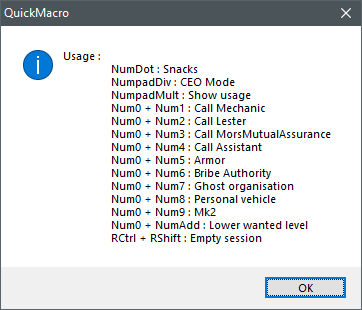

# QuickMacro
GTA Online useful macros  
This is a fork from https://github.com/MacMailler/QuickMacro that I reworked to do what I want it to do. Big Thanks to MacMailler for creating QuickMacro. 

Features like sound when enabling QuickMacro/CEO Mode or Empty session are coming from Kezoura (https://github.com/kezoura/GTAO-Macro)

### Installation and using
1. [Download](https://github.com/Liscum/QuickMacro/raw/master/QuickMacro.exe) latest version
2. Run GTA Online
3. Run QuickMacro.exe (after opening GTAV window)
4. Press the "End" key

### Hotkeys
+ End - Enable/Disable
+ NumDot : Snacks
+ NumpadDiv : CEO Mode
+ NumpadMult : Show usage
+ Num0 + Num1 : Call Mechanic
+ Num0 + Num2 : Call Lester
+ Num0 + Num3 : Call MorsMutualAssurance
+ Num0 + Num4 : Call Assistant
+ Num0 + Num5 : Armor
+ Num0 + Num6 : Bribe Authority
+ Num0 + Num7 : Ghost organisation
+ Num0 + Num8 : Personal vehicle
+ Num0 + Num9 : Mk2
+ Num0 + NumAdd : Lower Wanted Level
+	RCtrl + RShift : Empty session

While in game, hitting NumpadMult will show the association between keys and actions : 

  

